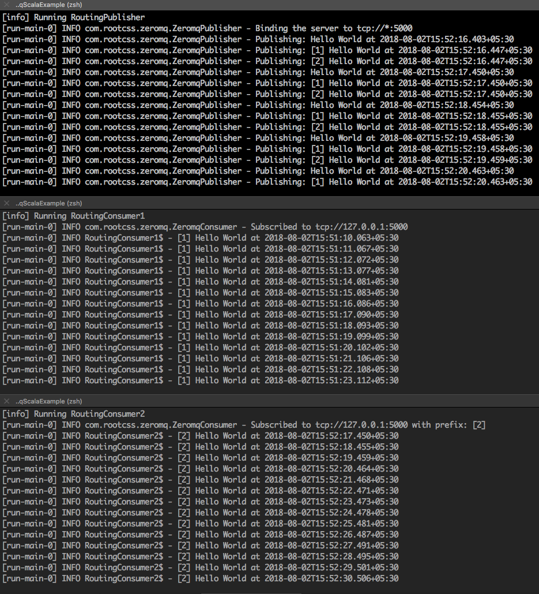

### Zeromq Scala Example

Sample fanout based example. It uses java-based implementation of Zeromq called <a href="https://github.com/zeromq/jeromq">Jeromq</a>

##### Simple consumer/producer examples

Start consumer using:

`sbt "runMain Consumer"`

Start publisher using:

`sbt "runMain Publisher"`

##### Routing based consumer/producer examples

Start consumers using:

`sbt "runMain RoutingConsumer1"` and `sbt "runMain RoutingConsumer2"`

Start publisher using:

`sbt "runMain RoutingPublisher"`

##### Sample output:

